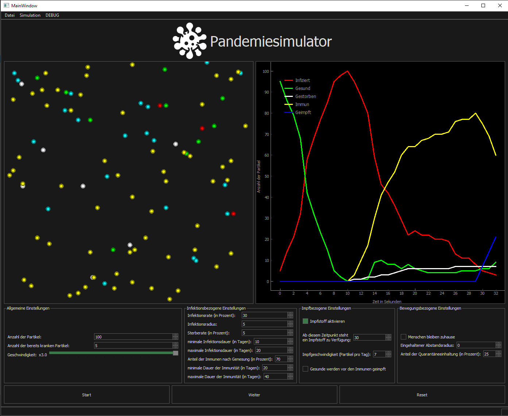

# Pandemic Simulation

This Pandemic Simulation is a Python application for simulating pandemics with different parameters. (WARNING: This simulation can only be used in a non scientific environment and can not be referenced as it not representing real pandemic circumstances.)

## Installation

Clone this repo, install the dependencies with pip from the requirement.txt and start the application from main.py.

```bash
git clone https://btn7k8.inf.uni-bayreuth.de/gitlab/praktikum2021/ai-1/karim.git
pip install requirements.txt
python main.py
```

## Usage

## Standard simulation



There are different parameters that can be configured:

**General parameters:**

- Number of particles (self explanatory)
- Number of initial infected particles (self explanatory)
- Simulation speed (self explanatory)

**Infection related parameters:**

- Infection rate (probability with which particles can infect each other)
- Infection radius (size of the radius in which the probability of infection is activated)
- Death rate (probability with which particles are dying after their infection)
- Minimum days of Infection (self explanatory)
- Maximum days of Infection (self explanatory)
- Immune percentage (percentage of particles being immune after their infection)
- Minimum days of being Immune (self explanatory)
- Maximum days of being Immune (self explanatory)

**Vaccination related parameters:**

- Activate Vaccine (vaccination means endlessly being immune)
- Date of Vaccine (After this date the vaccination progress begins)
- Speed of Vaccination (Number of particles being vaccinated per day)
- Activate that healthy particles are vaccinated before immune ones (self explanatory)

**Movement related parameters:**

- People staying at home (particles are gathering together at home, some particles are nevertheless changing their places until everyone is at their place)
- Distance radius (the amount of distance particles hold to each other)
- Quarantine percentage (percentage of infected particles that quarantine and therefore cannot infect others)

## Running multiple simulations


There are different parameters that can be configured:

**General parameters:**

- Number of simultaneously simulations (self explanatory)
- Duration of the simulations (self explanatory)
- Number of particles (self explanatory)
- Number of initial infected particles (self explanatory)

**Infection related parameters:**

- Infection rate (probability with which particles can infect each other)
- Infection radius (size of the radius in which the probability of infection is activated)
- Death rate (probability with which particles are dying after their infection)
- Minimum days of Infection (self explanatory)
- Maximum days of Infection (self explanatory)
- Immune percentage (percentage of particles being immune after their infection)
- Minimum days of being Immune (self explanatory)
- Maximum days of being Immune (self explanatory)

**Vaccination related parameters:**

- Activate Vaccine (vaccination means endlessly being immune)
- Date of Vaccine (After this date the vaccination progress begins)
- Speed of Vaccination (Number of particles being vaccinated per day)
- Activate that healthy particles are vaccinated before immune ones (self explanatory)

**Movement related parameters:**

- Distance radius (the amount of distance particles hold to each other)
- Quarantine percentage (percentage of infected particles that quarantine and therefore cannot infect others)

## Contributing
Pull requests are welcome. For major changes, please open an issue first to discuss what you would like to change.

## License
[MIT](https://choosealicense.com/licenses/mit/)

